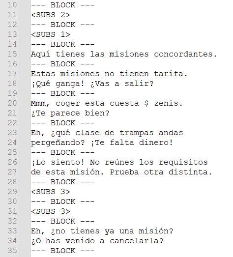

# `.gmd` File Extraction and Repacking Tools – MH3U

This repository contains plain text files extracted from *.gmds.

---

## 📦 `.gmd` File Structure

A `.gmd` file consists of two main parts:

1. **Header (`.header`)**:
   - Extracted from the beginning of the file **up to and including the last byte with value `0x12`**.
   - This defines the end of the binary header region before the UTF-8 text begins.
   - Contains binary metadata and structural information.
   - Ends at the last byte `0x12`, which marks the division between the header and text content.

2. **Text Content (`.txt`)**:
   - UTF-8 text blocks separated by `--- BLOCK ---`.
   - Each block is split by `0x00` in the binary file.
   - Line breaks are represented by `0x0D 0x0A`.

**Example**:

For file "Npc001_spa.gmd, we see the last "0x12" byte is at offset 4E. From there, we have some UTF-8
encoded text strings separated in "blocks" delimited by byte "0x00".

<div style="background-color: #ffffff; display: inline-block; padding: 4px;">
  
</div>

Knowing that, we spare the "header" in a file and the text in another one...

<div style="background-color: #ffffff; display: inline-block; padding: 4px;">
  
</div>

... replacing the "0x00" bytes by "--- BLOCK ---\n" placeholder string.

<div style="background-color: #ffffff; display: inline-block; padding: 4px;">
  
</div>

After editing the .txt with translated text, it´s just a matter of join the header and txt replacing
"--- BLOCK ---\n" string by "0x00".

---

## 📦 `.gmd` File names

---
The gmd files with same names are actually the same file repeated across several directories. Ex:
```
.\arc\ID\msg\ID_equipmsg_16_spa.arc\GUI\font\Acce_Exp_spa.gmd
.\arc\ID\msg\ID_equipmsg_15_spa.arc\GUI\font\Acce_Exp_spa.gmd
.\arc\ID\msg\ID_equipmsg_14_spa.arc\GUI\font\Acce_Exp_spa.gmd
.\arc\ID\msg\ID_equipmsg_17_spa.arc\GUI\font\Acce_Exp_spa.gmd
.\arc\ID\msg\ID_equipmsg_20_spa.arc\GUI\font\Acce_Exp_spa.gmd
.\arc\ID\msg\ID_equipmsg_19_spa.arc\GUI\font\Acce_Exp_spa.gmd
.\arc\ID\msg\ID_equipmsg_18_spa.arc\GUI\font\Acce_Exp_spa.gmd
.\arc\ID\msg\ID_equipmsg_09_spa.arc\GUI\font\Acce_Exp_spa.gmd
.\arc\ID\msg\ID_equipmsg_08_spa.arc\GUI\font\Acce_Exp_spa.gmd
.\arc\ID\ID_res_spa.arc\GUI\font\Acce_Exp_spa.gmd
```
Files named **Acce_Exp_spa.gmd** are exacty the same. Ex:
```
> fc.exe /b .\arc\ID\ID_lb_spa.arc\GUI\font\Acce_Exp_spa.gmd .\arc\ID\msg\ID_equipmsg_17_spa.arc\GUI\font\Acce_Exp_spa.gmd
Comparing files .\ARC\ID\ID_LB_SPA.ARC\GUI\FONT\Acce_Exp_spa.gmd and .\ARC\ID\MSG\ID_EQUIPMSG_17_SPA.ARC\GUI\FONT\ACCE_EXP_SPA.GMD
FC: no differences encountered
```

Other files have less copies, through less directories:

```
.\arc\ID\ID_lb_spa.arc\GUI\font\lobby\Nothing_spa.gmd
.\arc\ID\msg\ID_equipmsg_08_spa.arc\GUI\font\lobby\Nothing_spa.gmd
```

For either case, we need to translate it only once and copy the traslated one over its siblings.

---

## 🛠️ Available Scripts

### 1. `unpack_gmd.py`

Extracts a `.gmd` file into two parts:

- A `.txt` file containing readable text blocks.
- A `.header` file containing the raw binary header bytes.

**Usage:**

```bash
python unpack_gmd.py path/to/file.gmd --execute
```

Without `--execute`, the script only simulates the extraction (dry-run).

Required environment variables:

```bash
ARC_EXTRACTED_DIR  # Base path where original .gmd files are located
GMD_TXT_DIR        # Where to save .header files
GMD_TXT_PTBR_DIR   # Where to save translated .txt files
```

---

### 2. `repack_gmd.py`

Rebuilds a `.gmd` from a translated `.txt` and its corresponding `.header`.

- Combines both parts and generates a final `.gmd` binary.
- Validates that no line exceeds 100 characters.

**Usage:**

```bash
python repack_gmd.py path/to/file.txt
```

---

## 📌 `.txt` Format

The extracted or translated `.txt` file must follow this format:

```
First text line
--- BLOCK ---
Second text line
Third text line
--- BLOCK ---
...
```

Each `--- BLOCK ---` represents a logical break between entries in the `.gmd`.

---

## ✅ Requirements

- Python 3.7+
- No external dependencies
- Properly configured environment variables

---

## 📂 Example Environment Variables

```powershell
$env:ARC_EXTRACTED_DIR = "C:\temp\mh3u_ptbr\arc_extracted"
$env:GMD_TXT_DIR = "C:\temp\mh3u_ptbr\gmd_texts"
$env:GMD_TXT_PTBR_DIR = "C:\temp\mh3u_ptbr\gmd_texts_ptbr"
```

## 📝 Text Files

### Original Spanish Game Texts (`gmd_texts/`)

Located under:

```
gmd_texts/*/*/*/*/*/*/*/*.txt
```

These are the Original Spanish versions of the `.gmd` files.

Example:

* `Npc001_spa.txt` through `Npc025_spa.txt`: NPC dialogue
* `NpcName_spa.txt`: NPC name labels
