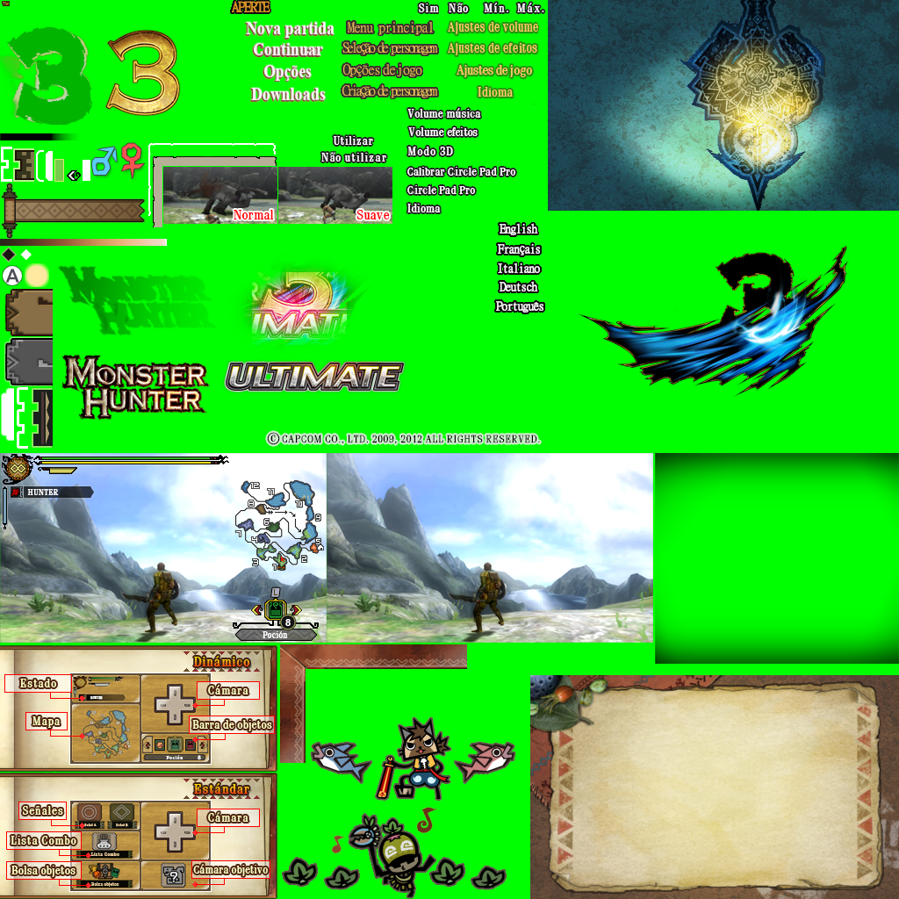
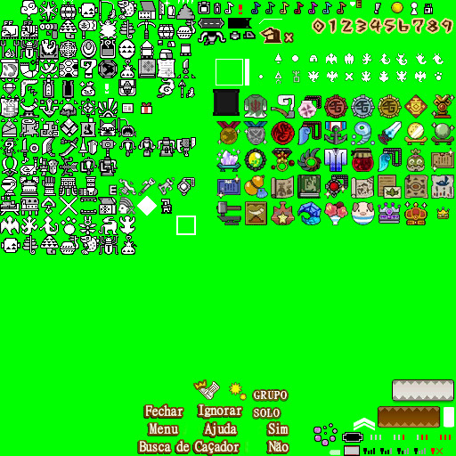
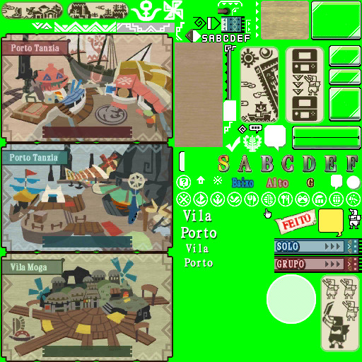
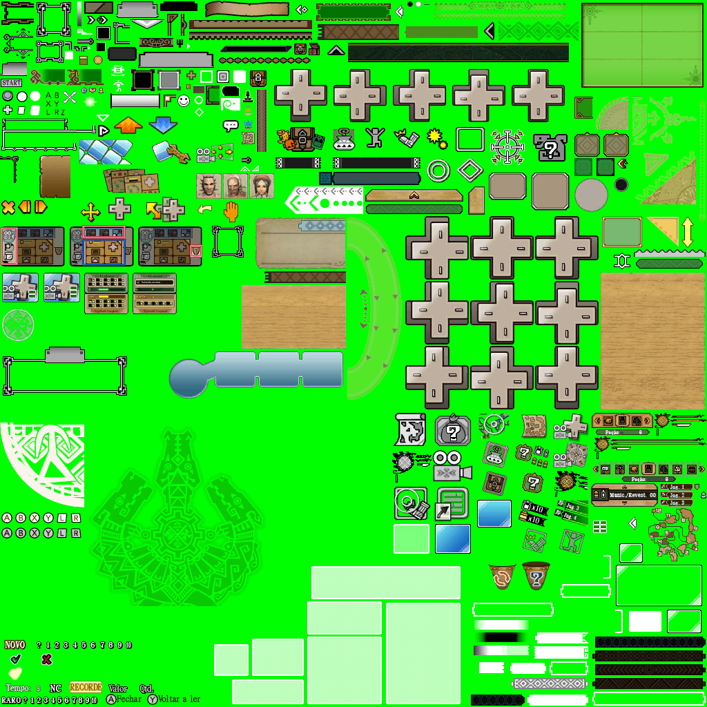

# Texture Font References for Localization

This document describes the usage, font styling, and purpose of specific `.tex` texture files used in the UI text rendering for Monster Hunter 3 Ultimate (MH3U) localization.

---

## 🎨 `st_menu_01_spa.tex`

Used for rendering **icon-style text labels** within startup menus.

### ✏️ Font Settings

* **Font**: MingLiU\_HKSCS-ExtB Bold 
* **Font Color**: `#??????` 
* **Outline**: +2px, `#??????`

<div style="background-color: #00ff00; display: inline-block; padding: 4px;">
  
</div>

---

## 🎨 `td_icon_ID_spa.tex`

Used for rendering **icon-style text labels** within the interface.

### ✏️ Font Settings

* **Font**: MingLiU\_HKSCS-ExtB Bold 16
* **Font Color**: `#ffffdd` (pale yellow)
* **Outline**: +2px, `#723f00` (brown)

<div style="background-color: #00ff00; display: inline-block; padding: 4px;">
  
</div>

---

## 🎨 `td_M_v_under_ID_spa.tex`

Used to display **zone or map names** like "Port" and "Village" (Porto/Vila).

### ✏️ Font Layers and Contexts

#### Main Labels (e.g. Porto / Vila)

##### Big
* **Font**: MingLiU\_HKSCS-ExtB Bold 20
* **Font Color**: `#ffffff` (white)
* **Outline**: +2px, `#000000` (black)

##### Little
* **Font**: MingLiU\_HKSCS-ExtB Bold 16
* **Font Color**: `#ffffff` (white)
* **Outline**: +2px, `#000000` (black)

#### Baixo

* **Font**: MingLiU\_HKSCS-ExtB Bold 16
* **Font Color**: `#19aeec` (blue)
* **Outline**: +2px, `#17154f` (navy)

#### Alto

* **Font Color**: `#e3b8b8` (light pink)
* **Outline**: +2px, `#8c2738` (burgundy)

#### FEITO

* **Font Color**: `#e81f13` (red)
* **Outline**: +2px, `#fff7e6` (cream)

<div style="background-color: #00ff00; display: inline-block; padding: 4px;">
  
</div>

---

## 🎨 `td_com_ID_spa.tex`

Used for rendering **icon-style text labels** map from the Forest and beyond.

### ✏️ Font Settings

#### Fechar/Voltar a ler

* **Font**: MingLiU\_HKSCS-ExtB Bold 13
Two layers, Antialiasing=ON
* **Layer 1 Font Color**: `#332516` (brown)
* **Layer 2 Font**: `#000000` (black)

#### Valor / Qtd. / NC

* **Font Color**: `#ffffff` (white)
* **Outline**: +2px, `#0d0802` (brown)

#### All Paths
```
.\arc\ID\ID_arena_spa.arc\GUI\Texture\common\td_com_ID_spa.tex
.\arc\ID\ID_cock_spa.arc\GUI\Texture\common\td_com_ID_spa.tex
.\arc\ID\ID_com_spa.arc\GUI\Texture\common\td_com_ID_spa.tex
.\arc\ID\ID_cus_spa.arc\GUI\Texture\common\td_com_ID_spa.tex
.\arc\ID\ID_dl_spa.arc\GUI\Texture\common\td_com_ID_spa.tex
.\arc\ID\ID_gallerydm_spa.arc\GUI\Texture\common\td_com_ID_spa.tex
.\arc\ID\ID_gallery_spa.arc\GUI\Texture\common\td_com_ID_spa.tex
.\arc\ID\ID_lb_spa.arc\GUI\Texture\common\td_com_ID_spa.tex
.\arc\ID\ID_resi_spa.arc\GUI\Texture\common\td_com_ID_spa.tex
.\arc\ID\ID_res_spa.arc\GUI\Texture\common\td_com_ID_spa.tex
.\arc\ID\ID_stmenu_spa.arc\GUI\Texture\common\td_com_ID_spa.tex
.\arc\ID\quest\camp_spa.arc\GUI\Texture\common\td_com_ID_spa.tex
```

<div style="background-color: #00ff00; display: inline-block; padding: 4px;">
  
</div>

---

## 🎨 `td_M_v_c8_00_ID_spa.tex`

Used for rendering lots of **text labels** and some icons.

### ✏️ Font Settings

#### Fazenda / Pescaria / Cantina / Balcão de Missões / Armazém / Ferraria 
#### Arsenal / Argosy / Posto de Trocas / Mercado / Loja da Guilda / Arena
#### Balsa / Mensageiro / Quadro de Missões


* **Font**: MingLiU\_HKSCS-ExtB Bold 16
Two layers, Antialiasing=ON
* **Layer 1 Font Color**: `#ffffff` (brown)
* **Layer 2 Font**: `#000000` (black)

#### All Paths
```
.\arc\ID\ID_arena_spa.arc\GUI\Texture\lobby\td_M_v_c8_00_ID_spa.tex
.\arc\ID\ID_dl_spa.arc\GUI\Texture\lobby\td_M_v_c8_00_ID_spa.tex
.\arc\ID\ID_gallerydm_spa.arc\GUI\Texture\lobby\td_M_v_c8_00_ID_spa.tex
.\arc\ID\ID_gallery_spa.arc\GUI\Texture\lobby\td_M_v_c8_00_ID_spa.tex
.\arc\ID\ID_lb_spa.arc\GUI\Texture\lobby\td_M_v_c8_00_ID_spa.tex
.\arc\ID\ID_stmenu_spa.arc\GUI\Texture\lobby\td_M_v_c8_00_ID_spa.tex
```

<div style="background-color: #00ff00; display: inline-block; padding: 4px;">
  
</div>
