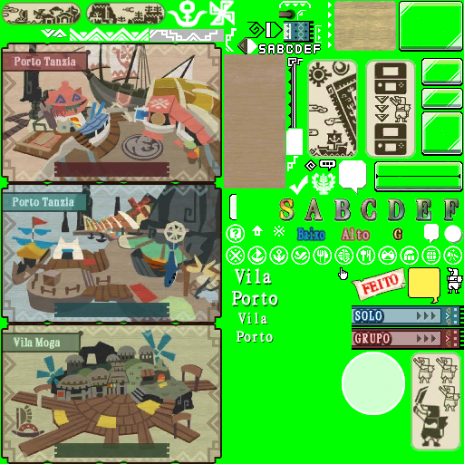

# Texture Font References for Localization

This document describes the usage, font styling, and purpose of specific `.tex` texture files used in the UI text rendering for Monster Hunter 3 Ultimate (MH3U) localization.

---

## 🎨 `st_menu_01_spa.tex`

Used for rendering **icon-style text labels** within startup menus.

### ✏️ Font Settings

* **Font**: MingLiU\_HKSCS-ExtB Bold 
* **Font Color**: `#??????` 
* **Outline**: +2px, `#??????`

  

---

## 🎨 `td_icon_ID_spa.tex`

Used for rendering **icon-style text labels** within the interface.

### ✏️ Font Settings

* **Font**: MingLiU\_HKSCS-ExtB Bold 16
* **Font Color**: `#ffffdd` (pale yellow)
* **Outline**: +2px, `#723f00` (brown)

  

---

## 🎨 `td_M_v_under_ID_spa.tex`

Used to display **zone or map names** like "Port" and "Village" (Porto/Vila).

### ✏️ Font Layers and Contexts

#### Main Labels (e.g. Porto / Vila)

##### Big
* **Font**: MingLiU\_HKSCS-ExtB Bold 20
* **Font Color**: `#ffffff` (white)
* **Outline**: +2px, `#000000` (black)

##### Little
* **Font**: MingLiU\_HKSCS-ExtB Bold 16
* **Font Color**: `#ffffff` (white)
* **Outline**: +2px, `#000000` (black)

#### Baixo

* **Font**: MingLiU\_HKSCS-ExtB Bold 16
* **Font Color**: `#19aeec` (blue)
* **Outline**: +2px, `#17154f` (navy)

#### Alto

* **Font Color**: `#e3b8b8` (light pink)
* **Outline**: +2px, `#8c2738` (burgundy)

#### FEITO

* **Font Color**: `#e81f13` (red)
* **Outline**: +2px, `#fff7e6` (cream)

  

---

