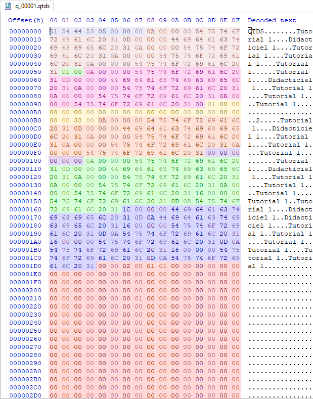
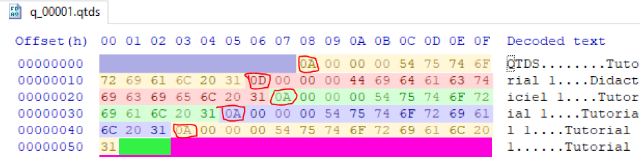
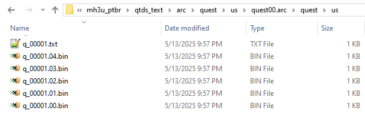
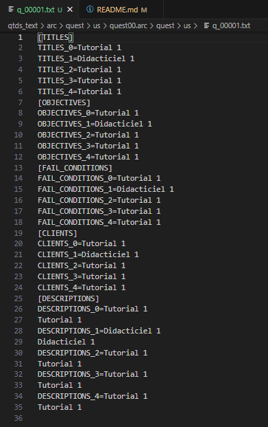

# 🧾 `.qtds` File Format Documentation

This document outlines the internal structure of `.qtds` files used by **Monster Hunter 3 Ultimate (MH3U)** on the Nintendo 3DS and Wii U.

`.qtds` files define the content of quests, including:
- Quest titles and objectives (in multiple languages)
- Client and quest descriptions
- Failure conditions
- Map and monster configuration
- Internal identifiers and metadata

These files are parsed by the game engine to dynamically render quests in the UI, control arena logic, spawn monsters, and determine win/fail conditions.

This documentation is the result of hands-on reverse engineering, aligned with findings from community tools, modding threads, and byte-for-byte comparisons across multiple quest files.

> ✅ Example used: [`.\q_00001.qtds`](./q_00001.qtds)

---

## 🗂 `.qtds` File Structure Map (Offsets 0x000–0x781) of Arena Quests

Below is some knowledge we extracted from the observed structure.

| Start   | End     | Size (dec) | Size (hex) | Description                                      |
|---------|---------|------------|------------|--------------------------------------------------|
| `0x000` | `0x003` | 4          | `0x04`     | Magic header `"QTDS"`                           |
| `0x004` | `0x007` | 4          | `0x04`     | Entry count or unknown (likely unused)          |
| `0x008` | `0x09D` | 151        | `0x97`     | **Quest Titles** (5× [4-byte length + UTF-8])   |
| `0x09E` | `0x09E` | 1          | `0x01`     | **Unknown** Varies from file to file            |
| `0x09F` | `0x09F` | 1          | `0x01`     | **Quest ID** (e.g. `0xEA`)                      |
| `0x0A0` | `0x12F` | 144        | `0x90`     | **Quest Objectives** (5× [4-byte length + UTF-8]) |
| `0x130` | `0x133` | 4          | `0x04`     | **Unknown — varies across `.qtds` files**       |
| `0x134` | `0x14B` | 18         | `0x12`     | **Fixed block — identical across all quests**   |
| `0x14C` | `0x254` | 169        | `0x109`    | **Fail Conditions** (5× [4-byte length + UTF-8])|
| `0x255` | `0x25A` | 6          | `0x06`     | **Unknown — varies across files**               |
| `0x25B` | `0x2D2` | 120        | `0x78`     | **Client Names** (5× [4-byte length + UTF-8])   |
| `0x2D3` | `0x2DA` | 8          | `0x08`     | **Unknown**                           |
| `0x2DB` | `0x70D` | 1075       | `0x433`    | **Mission Descriptions** (5× [4-byte length + UTF-8]) |
| `0x70E` | `0x751` | 68         | `0x44`     | **Unknown Block A**                             |
| `0x752` | `0x775` | 36         | `0x24`     | **Unknown Block B — always starts with `01`**   |
| `0x776` | `0x858` | 227        | `0xE3`     | **Unknown Block C — always starts with `04 01`**|
| `0x859` | `0x868` | 17         | `0x11`     | **Repeating pattern — possibly shared config**  |
| `0x869` | `0x880` | 24         | `0x18`     | **Block of `0x03` bytes followed by padding `0x00`** |

So, we were able to extract all "editable" chunks, preserving the "fixed" ones, edit, and repack.

From that we´ve figured it out the file could be divided in 5 parts:

A Header
Quest titles
Two non UTF-8 bytes
Quest objectives
24 non UTF-8 bytes
Fail conditions
Six non UTF-8 bytes
Quest clients
Quest description
Non UFT-8 bytes until EOF

  

Each of the "UTF-8 blocks" contains the 5 languages available in order. For each language, the first
four bytes are the size of the text string.

  

An extraction script grabs the 5 "non UTF-8" parts and store them across different files along with a
file with the text to be translated.

  

  

The text file and the stored non text bytes are rejoined after text translation.